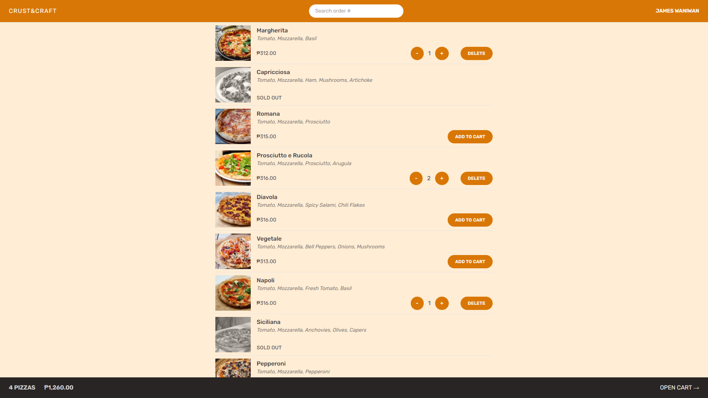

<!-- PROJECT LOGO -->
 
<h1 align="center">Crust & Craft</h1>

<!-- ABOUT THE PROJECT -->

## About The Project

This project was built as part of The Ultimate React Course 2024 by Jonas Schmedtman, with additional enhancements and refinements. Crust & Craft is a simple yet efficient pizza ordering app designed for a seamless user experience.

<!-- APPLICATION'S FEATURES -->

## 📝 Features

- Easy Ordering: select and customize pizzas effortlessly.

- Cart & Order Summary: add multiple pizzas, review, and modify orders.

- Priority Orders: users can mark their order as "priority" for faster delivery, with an additional 20% charge.

- Location Tracking: auto-fill your address for convenience.

- Order Tracking: get a unique order number to check status anytime.

<!-- TECHNOLOGY USED -->

## 👨‍💻 Technology Used

- **React**: A JavaScript library for building dynamic user interfaces.

  - **React Router**: Enables navigation and routing in the app.

  - **React Redux**: Manages the application's state efficiently.

- **Tailwind CSS**: A utility-first CSS framework for fast and flexible styling.

<!-- LIVE DEMO -->

## 🚀 Live Demo

[https://crust-and-craft.vercel.app/](https://crust-and-craft.vercel.app/)

<!-- ACKNOWLEDGEMENTS -->

## Acknowledgments

This application was one of the projects completed within the [Udemy course](https://www.udemy.com/course/the-ultimate-react-course) "The Ultimate React Course 2024: React, Redux & More," instructed by [Jonas Schmedtman](https://twitter.com/jonasschmedtman).
